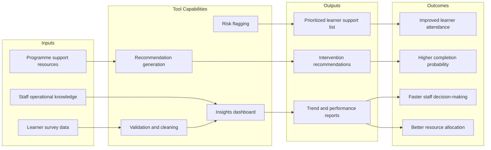

# Value Model Diagram

## Value Proposition Summary
The Student Support Insights Tool helps programme teams convert learner survey data into timely, practical interventions that improve learner retention and success while using resources more effectively.

## Value Model Canvas

## Stakeholder Value Mapping
| Stakeholder | Value Received | Evidence Indicator |
|---|---|---|
| Learners | Earlier and more relevant support | Reduced high-risk attendance category |
| Programme staff | Quicker insight-to-action cycle | Faster intervention turnaround time |
| Programme leadership | Better planning and accountability | Monthly trend report quality and usage |
| IT support | Clear requirements and governance | Fewer incidents and access control issues |

## Assumptions To Validate
- Staff use dashboard outputs at least once per week.
- Interventions are recorded consistently after each action.
- Learners consent to data use for support improvement.
