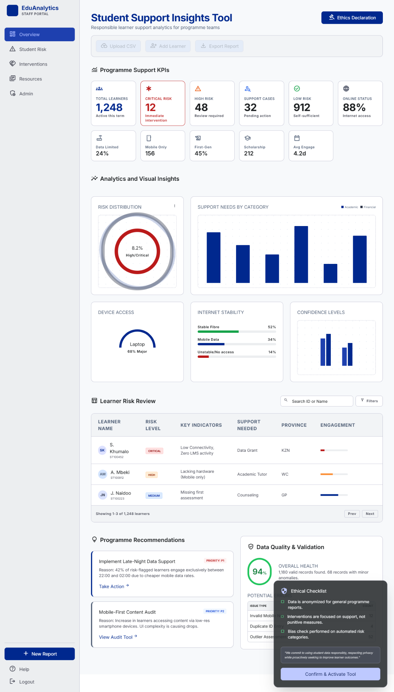
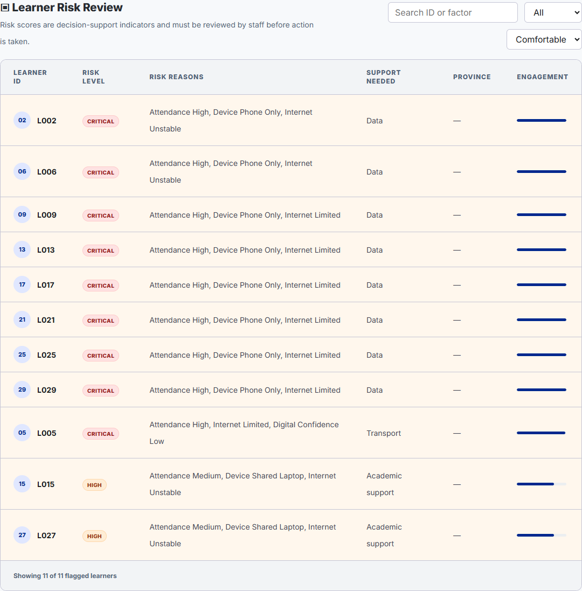
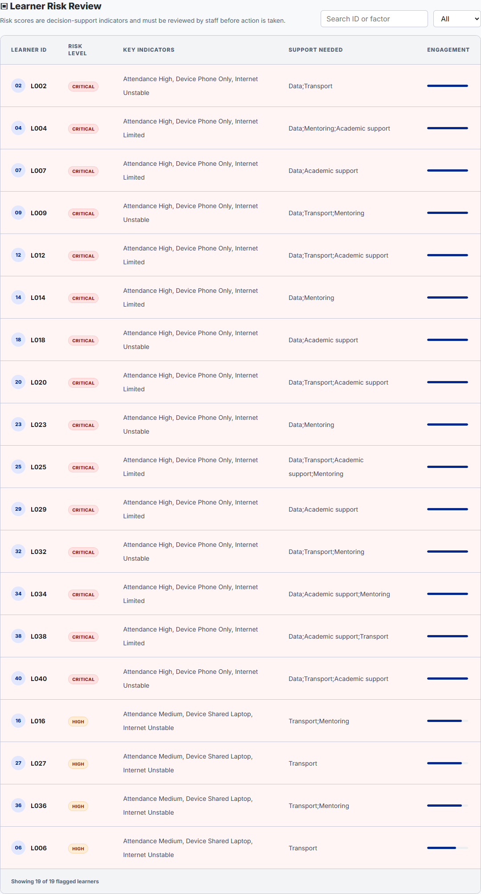
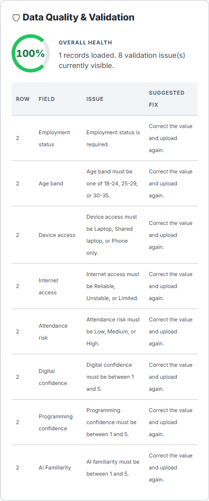
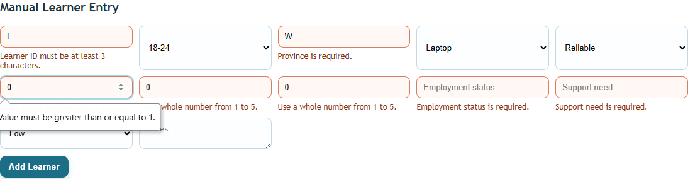
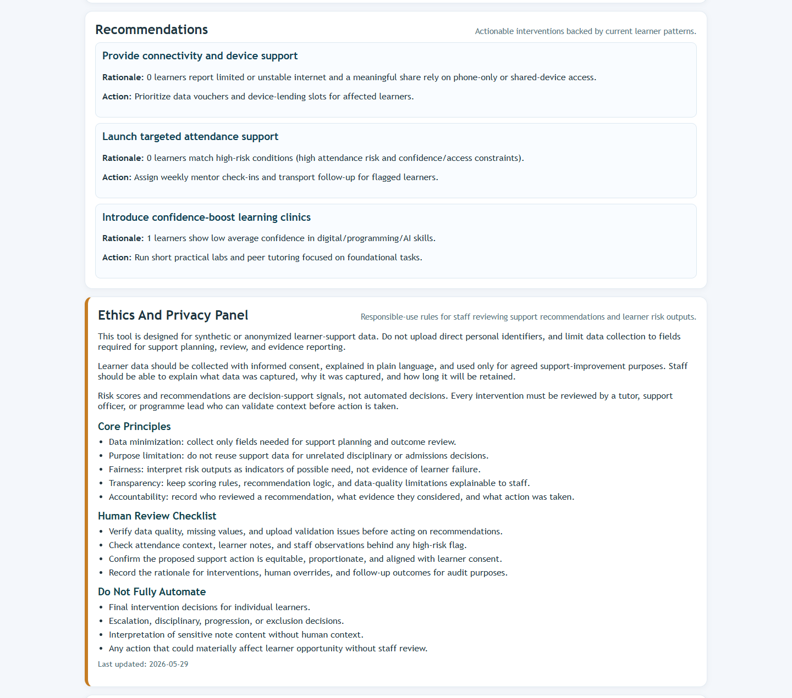
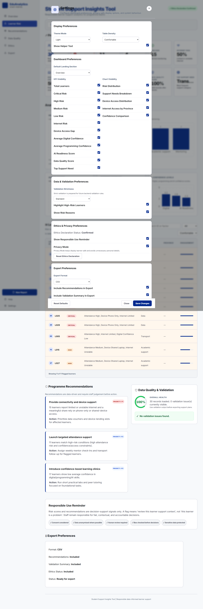
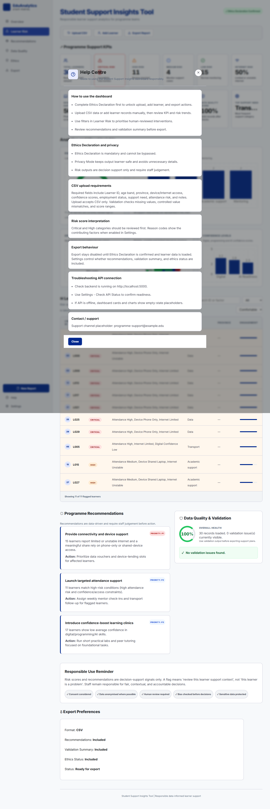
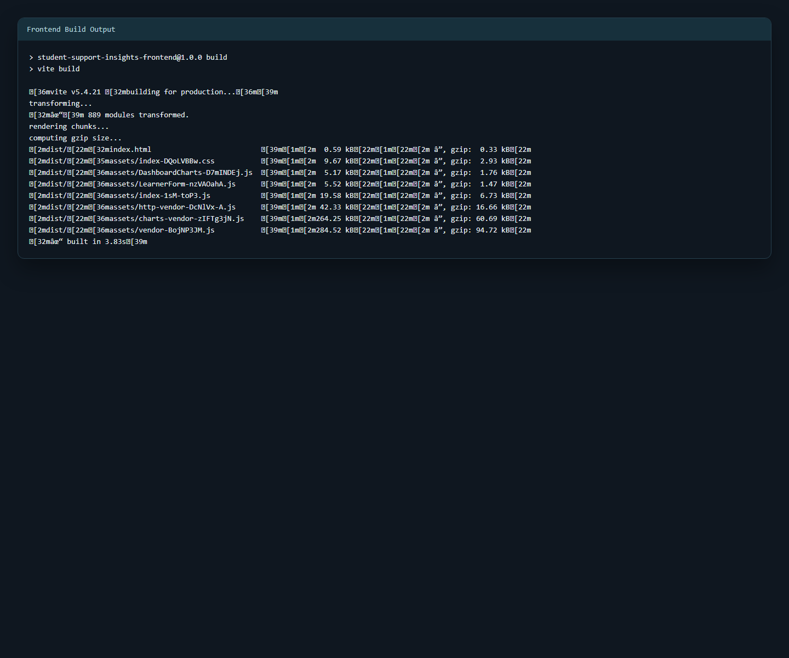
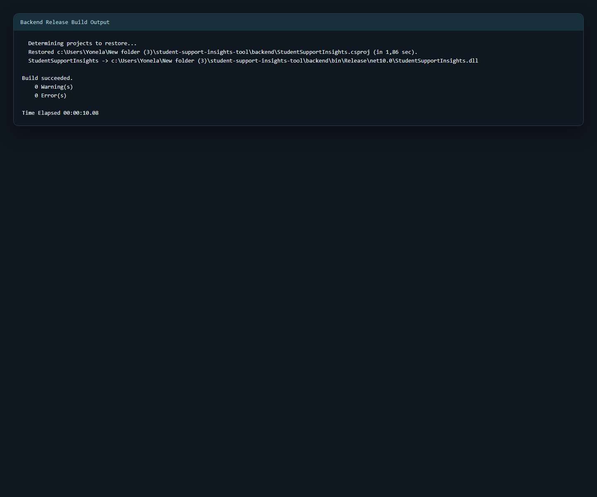

# Final Submission Document

## Cover Page
- Project Title: Student Support Insights Tool
- Student Name: Yonela Jongola
- Student Number: 12525456122
- Course: SFIA Level 3 Integrated Assessment
- Submission Date: 01/06/2026

## Executive Summary
This submission presents the completed Student Support Insights Tool prototype. The final system helps programme teams upload or capture learner support data, validate it, view dashboard trends, identify learners who may need earlier support, and generate practical recommendations for human-reviewed intervention planning. Synthetic data was used throughout to reduce privacy risk while still demonstrating realistic system behavior.

The final version also includes settings-driven display preferences, ethics confirmation before sensitive actions, confirmation on every data upload, confirmation before clearing report state, and refreshed screenshot and build evidence for submission review.

## 1. Problem Statement And Context
Digital skills programmes often collect useful learner information, but the data is not always analyzed early enough or consistently enough to support timely intervention. This can delay support and reduce consistency in staff decision-making. This project addresses the following core question:

How can a programme team use learner data responsibly to identify support needs, prioritize support actions, and improve learner success?

## 2. Stakeholder And User Needs
Primary stakeholders include learners, programme staff, leadership, IT support, and mentors. Learners require timely and fair support. Staff require clear evidence for prioritization. Leadership requires performance visibility for planning and resource allocation. Supporting models:

- Stakeholder map: docs/FinalReport/stakeholder_map_template.md
- Value model: docs/BusinessModels/value_model_diagram.md
- Completed peer/stakeholder review record: docs/Documentation/completed_peer_stakeholder_review.md
- Assessor walkthrough review: docs/Documentation/assessor_walkthrough_review.md

## 3. Current Process And Improved Process
The as-is process is mostly manual and depends on spreadsheet review. The to-be process is more organized: capture or upload learner data, validate it, generate dashboard analytics, flag possible support risk, produce recommendations, and let staff review the result before taking action.

- As-is model: docs/ProcessModels/as_is_process_template.md
- To-be model: docs/ProcessModels/to_be_process_template.md

## 4. Data Description And Preparation
Dataset: 30 synthetic learner records with fields for access, confidence, support need, and attendance risk. Data quality controls implemented:

- Missing value checks
- Controlled-value validation for age band, device access, internet access, and attendance risk
- Duplicate learner ID detection
- Confidence range checks (1 to 5)
- Quote-aware CSV parsing for notes containing commas
- Row-level validation errors with line numbers for rejected uploads
- Inline manual-form validation support

Supporting evidence:

- Dataset: data/Dataset/synthetic_learners.csv
- Data dictionary: data/Dataset/data_dictionary.md

## 5. Analytics Findings And Visualizations
The final prototype exceeds the minimum visualization requirement with five implemented charts:

- Risk distribution across Low, Medium, High, and Critical categories
- Support need distribution
- Device access distribution
- Internet access by province
- Confidence comparison across digital, programming, and AI familiarity scores

Key findings include concentration of high-risk learners, internet and device constraints, uneven confidence across digital capability areas, and recurring support needs that can be prioritized for intervention planning.

- Findings: docs/FinalReport/analytics_findings.md

## 6. Prototype Description
Implemented features:

- CSV upload and manual entry
- Inline and row-level validation feedback
- Dashboard with KPI cards and 5 charts
- Searchable and filterable high-risk learner table with score, priority, and reason codes
- Recommendation output (3 practical recommendations)
- Ethics/privacy notice with human review checklist
- Help and Settings modal workflow
- Settings persistence and configurable dashboard display controls
- Upload confirmation on every file upload
- New Report confirmation before clearing loaded learner data
- CSV export

Technical implementation:

- Backend: ASP.NET Core (.NET 10)
- Frontend: React + TypeScript + Vite + Recharts
- Main run guide: README.md

## 7. AI, Data Ethics, And Privacy Review
The ethics section was strengthened because the tool works with learner support indicators such as access, confidence, attendance risk and support needs. Even without names, this information can influence how learners are understood by staff, so the prototype treats it as confidential support information.

The prototype follows these responsible-use principles:

- Data minimization: no names, ID numbers, phone numbers, home addresses or unnecessary identifiers are required.
- Purpose limitation: the data is only for learner support planning, not discipline, exclusion, admissions or unrelated decisions.
- Transparency: the risk score is rule-based and shows reason codes so staff can understand why a learner was flagged.
- Fairness: access barriers such as limited internet or phone-only learning are treated as resource needs, not learner failure.
- Human review: risk flags are support signals only; a staff member must review context before any intervention.
- Harm prevention: the tool must not automate disciplinary, progression, funding or exclusion decisions.

Final interface controls also reinforce this approach:

- Ethics confirmation before upload, manual entry, and export
- Privacy mode in display settings
- Responsible-use reminder messaging
- Confirmation before upload and before clearing report state

The ethics review also includes a privacy notice, consent guidance, human-review workflow, data retention recommendation, bias risks, security recommendations and a governance checklist.

- Ethics review: docs/EthicsReview/ethics_review.md
- Ethics governance checklist: docs/EthicsReview/ethics_governance_checklist.md

## 8. Methods, Tools, And Development Approach
Delivery followed a staged 15-day plan with iterative build-test-refine cycles and structured evidence capture. Later work focused on reliability hardening, settings architecture, UX refinements, and final QA evidence.

- Project plan: docs/FinalReport/project_plan.md
- 15-day plan: docs/FinalReport/15_day_delivery_plan.md

## 9. Testing, Bug Fixes, And Quality Evidence
Testing was completed across API behavior, validation paths, dashboard contract integrity, interaction flows, and frontend/backend build quality. Bugs were tracked and resolved with evidence for import parsing, risk explainability, upload feedback, modal behavior, and health-check handling.

- Test log: evidence/Testing/test_log.md
- Bug log: evidence/BugLogs/bug_log.md

Final QA confirmed:

- Help modal opens and closes correctly
- Settings modal opens and API status checks work
- Ethics confirmation gates sensitive actions
- Every upload triggers a confirmation prompt
- New Report triggers a confirmation prompt before clearing state
- Frontend typecheck passes and backend Release build succeeds

## 10. Reflection

### Personal learning note
This project helped me see that a dashboard is only useful if the data behind it is clean and the meaning of the numbers is clear. I also realized that risk scoring can be sensitive, so I kept the score explainable and included human review instead of presenting it as an automatic decision. A real version of this tool would still need review by programme staff and testing with properly anonymized data before being used operationally.

A major challenge was balancing the working prototype with all the evidence required by the assignment. Earlier versions were too focused on the dashboard and not enough on evidence mapping, testing, responsible-use wording, and reliability. I improved this by building around the assignment essentials first, then strengthening validation, ethics controls, settings behavior, screenshots, and final evidence traceability.

## 11. Evidence Inventory Mapped To SFIA Skills
See docs/FinalReport/evidence_inventory_sfia.md.

## 12. Final Submission Checklist
- Working prototype: Complete
- Integrated report: Complete
- Synthetic dataset: Complete
- Data dictionary: Complete
- 5 visualizations: Complete
- 5 or more insights: Complete
- 3 or more recommendations: Complete
- As-is and to-be process models: Complete
- Business/value model: Complete
- Ethics and privacy review: Complete
- Ethics governance checklist: Complete
- Testing log and bug log: Complete
- README/user guide: Complete
- SFIA evidence checklist: Complete
- Completed peer/stakeholder review record: Complete
- Screenshot evidence regenerated: Complete
- Frontend typecheck verified: Complete
- Backend Release build verified: Complete

## Appendices
Evidence is packaged in the following order for submission review:

- README and user guide
- Dataset and data dictionary
- Process models and value model
- Ethics review, governance checklist, privacy notice and responsible-use evidence
- Testing log, bug log, and SFIA evidence checklist
- Peer or stakeholder review record
- Screenshot appendix and build evidence

### Appendix A: Academic UI Redesign Reference
High-fidelity redesign reference used to guide the academic look-and-feel and information hierarchy.

### Appendix B: Dashboard Overview (Clean Report Capture)
Clean dashboard screenshot prepared for report readability, showing data input, KPI area, and visual insight cards.

### Appendix C: Learner Risk Review
Shows the staff review table with risk level, reason indicators, support category, and engagement bars.

### Appendix D: High-Risk Learner Table
Shows the searchable high-risk table with score, priority, and detailed factor chips for human-reviewed follow-up.

### Appendix E: CSV Upload Validation
Shows the row-level validation panel produced when invalid CSV values are uploaded.

### Appendix F: Manual Form Validation
Shows inline field-level validation on the manual learner entry form.

### Appendix G: Recommendations And Ethics
Shows recommendations alongside ethics and privacy guidance to support accountable staff decisions.

### Appendix H: Settings View
Shows dashboard preference controls for layout, chart visibility, privacy mode, and export behavior.

### Appendix I: Help View
Shows embedded guidance for onboarding staff, ethical use, CSV requirements, and troubleshooting.

### Appendix J: Frontend Build Evidence
Successful frontend production build output captured for submission evidence.

### Appendix K: Backend Build Evidence
Successful backend Release build output captured for submission evidence.

