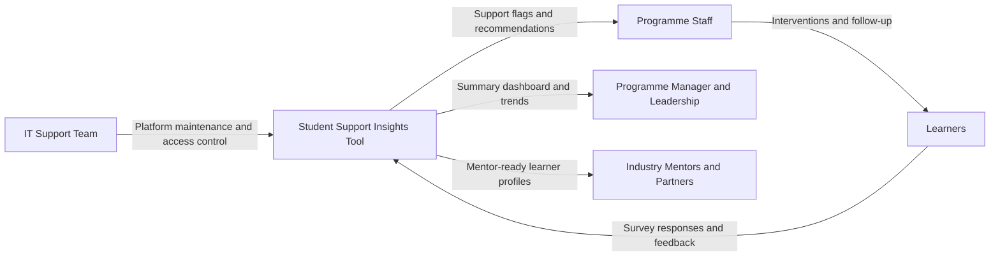
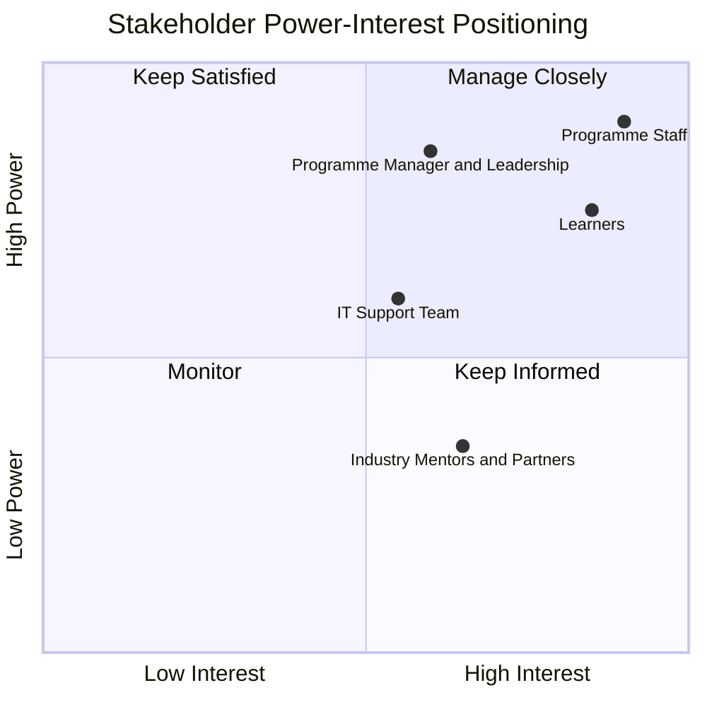

# Stakeholder Map

## Stakeholder Groups
- Programme staff
- Learners
- Programme manager and leadership
- IT support team
- Industry mentors and partners

## Stakeholder Needs And Interests
| Stakeholder | Primary Needs | Influence | Interest | What Success Looks Like |
|---|---|---|---|---|
| Learners | Fair support, practical guidance, timely intervention | High | High | Better attendance, confidence, and completion |
| Programme staff | Clear learner insights, prioritised support actions | High | High | Faster decisions and targeted support plans |
| Programme manager and leadership | Performance visibility, resource planning | High | Medium | Improved outcomes with evidence-based reporting |
| IT support team | Reliable and secure system operation | Medium | Medium | Stable app, low downtime, protected data |
| Industry mentors and partners | Meaningful engagement opportunities | Low | Medium | Better mentor matching and employability pathways |

## Stakeholder Map Diagram

## Power-Interest Matrix

## Engagement Plan
- Learners: weekly communication on support options, clear consent wording, and opt-out channel.
- Programme staff: bi-weekly insight review sessions and action tracking.
- Programme manager and leadership: monthly performance summary with risk and resource signals.
- IT support team: access reviews, backup checks, and incident process each sprint.
- Industry mentors and partners: monthly matching updates and feedback loop on learner readiness.
