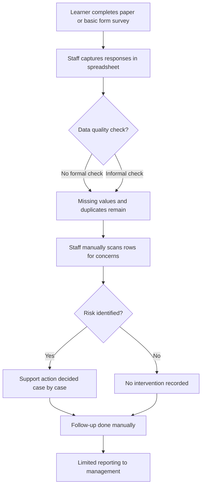

# As-Is Process Diagram

## Current Process Description
The current process relies on manual collection and review of learner survey information. Data is captured inconsistently, analysis is limited, and support responses are usually reactive after attendance or performance has already declined.

## Diagram

## Key Steps
1. Learner submits survey or support information.
2. Data is manually entered in a spreadsheet.
3. Quality issues are handled inconsistently.
4. Staff manually interprets trends and risks.
5. Support decisions are made per case without standard rules.
6. Reporting is occasional and mainly descriptive.

## Limitations
- Data quality errors are difficult to detect early.
- High-risk learners are not always flagged in time.
- Decision-making depends on individual staff judgement.
- No consistent audit trail of interventions and outcomes.
- Reporting is slow and not always actionable.
