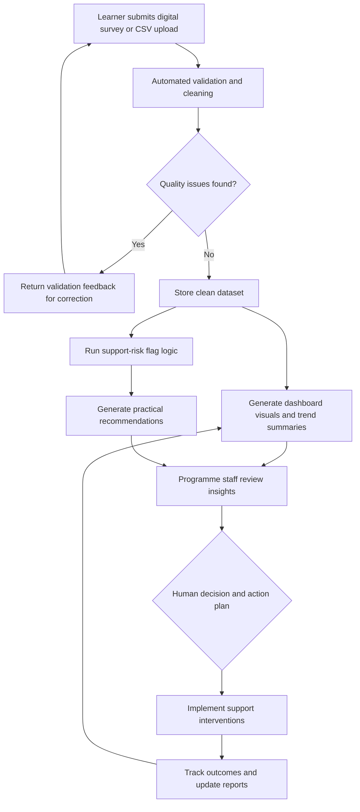

# To-Be Process Diagram

## Improved Process Description
The improved process uses the Student Support Insights Tool to capture data digitally, validate quality automatically, identify support risk consistently, and generate recommendations for staff review. Human oversight remains in all intervention decisions.

## Diagram

## Key Steps
1. Learner data is captured via digital form or upload.
2. Validation checks detect missing, invalid, and duplicate records.
3. Clean data drives dashboard analytics.
4. Risk flags identify high-priority learners and groups.
5. Recommendation engine proposes practical support actions.
6. Staff reviews outputs and decides interventions.
7. Outcomes are monitored for continuous improvement.

## Improvements
- Standardized and transparent data quality controls.
- Faster identification of learner support priorities.
- Consistent evidence-based recommendation outputs.
- Better reporting for leadership and stakeholder review.
- Stronger accountability through auditable intervention tracking.
